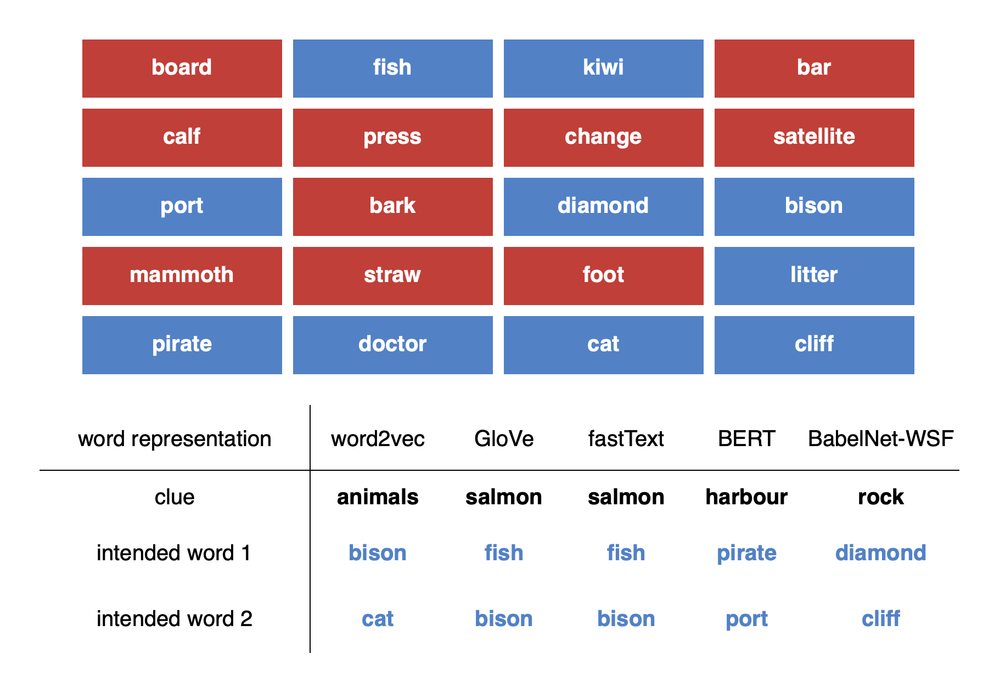

# Playing Codenames with Language Graphs and Word Embeddings

This is the code to accompany the paper ["Playing Codenames with Language Graphs and Word Embeddings"](https://arxiv.org/abs/2105.05885)



Examples of clues chosen by different embedding methods and the language graph BabelNet. All the clues chosen above make use of our DETECT algorithm.

## Setup

1. Clone this repo. `$ git clone git@github.com:divyakoyy/codenames.git`
2. `$ cd codenames`
3. `$ pip3 install requirements.txt`
4. Download this zipped file (CodenamesData.zip) containing all embedding data [here](https://drive.google.com/file/d/1F70CtbsoPPPDnV-ZAUq0i0Rrvtv6taoV/view?usp=sharing). This contains word2vec, GloVe, fastText, BERT, and Dict2Vec embeddings.
5. Unzip the CodenamesData.zip and move all contents of CodenamesData into your local codenames/data/
6. You're setup and ready to start playing codenames! 🥳

## Usage

To see all available options, run `$ python3 codenames.py --help`

To play codenames with the default configuration (using DETECT and our proposed scoring function), run any of these commands (note that for BabelNet, you first need a [BabelNet API key](https://babelnet.org/guide)):

`$ python3 codenames.py word2vec`; `$ python3 codenames.py glove`; `$ python3 codenames.py fasttext`; `$ python3 codenames.py bert`; `$ python3 codenames.py babelnet --babelnet-api-key $MY_BABELNET_API_KEY`

Note: because of the size of BabelNet, it may take some time to get results the first few runs when running with the `babelnet` option. Things should speed up on subsequent runs since we cache subgraphs of BabelNet.

#### Example Output

Here's an example where we run 2 trials (i.e. 2 Codenames boards) each for word2vec and GloVe to compare the clues produced by each embedding method. In our configuration, the computer is on the blue team and so it produces the best clues for the blue words.

```
$ python3 codenames.py word2vec glove --num-trials 2
Codenames Configuration:  {'verbose': False, 'visualize': False, 'split_multi_word': True, 'disable_verb_split': True, 'debug_file': None, 'length_exp_scaling': None, 'use_heuristics': True, 'single_word_label_scores': (1, 1.1, 1.1, 1.2), 'use_kim_scoring_function': False}
Building game for  glove ...

==================================================================================================================
TRIAL 1
RED WORDS:  ['spider', 'charge', 'key', 'parachute', 'moon', 'wake', 'duck', 'octopus', 'cloak', 'tower']
BLUE WORDS:  ['lawyer', 'satellite', 'kangaroo', 'luck', 'giant', 'board', 'pirate', 'robin', 'air', 'shadow']
BEST CLUES:

Clue(s): good || Intended board words: ('luck', 'board') || Score: -2.009

Clue(s): attorney || Intended board words: ('lawyer', 'board') || Score: -2.002

Clue(s): attorney || Intended board words: ('lawyer', 'robin') || Score: -2.0

Clue(s): radio || Intended board words: ('satellite', 'pirate') || Score: -1.951

Clue(s): attorney || Intended board words: ('lawyer', 'shadow') || Score: -1.95

==================================================================================================================
TRIAL 2
RED WORDS:  ['saturn', 'bill', 'bug', 'bottle', 'string', 'ice', 'vacuum', 'beijing', 'brush', 'pyramid']
BLUE WORDS:  ['bark', 'witch', 'tag', 'heart', 'ray', 'circle', 'state', 'robin', 'greece', 'contract']
BEST CLUES:

Clue(s): greek || Intended board words: ('witch', 'greece') || Score: -2.096

Clue(s): greek || Intended board words: ('state', 'greece') || Score: -2.057

Clue(s): holly || Intended board words: ('bark', 'robin') || Score: -1.948

Clue(s): greek || Intended board words: ('circle', 'greece') || Score: -1.892

Clue(s): greek || Intended board words: ('heart', 'greece') || Score: -1.864

Codenames Configuration:  {'verbose': False, 'visualize': False, 'split_multi_word': True, 'disable_verb_split': True, 'debug_file': None, 'length_exp_scaling': None, 'use_heuristics': True, 'single_word_label_scores': (1, 1.1, 1.1, 1.2), 'use_kim_scoring_function': False}
Building game for  word2vec ...
==================================================================================================================
TRIAL 1
RED WORDS:  ['spider', 'charge', 'key', 'parachute', 'moon', 'wake', 'duck', 'octopus', 'cloak', 'tower']
BLUE WORDS:  ['lawyer', 'satellite', 'kangaroo', 'luck', 'giant', 'board', 'pirate', 'robin', 'air', 'shadow']
BEST CLUES:

Clue(s): finch || Intended board words: ('kangaroo', 'robin') || Score: -2.127

Clue(s): barrister || Intended board words: ('lawyer', 'kangaroo') || Score: -2.101

Clue(s): attorney || Intended board words: ('lawyer', 'board') || Score: -2.088

Clue(s): barrister || Intended board words: ('lawyer', 'robin') || Score: -2.053

Clue(s): trustees || Intended board words: ('board', 'robin') || Score: -2.011
==================================================================================================================
TRIAL 2
RED WORDS:  ['saturn', 'bill', 'bug', 'bottle', 'string', 'ice', 'vacuum', 'beijing', 'brush', 'pyramid']
BLUE WORDS:  ['bark', 'witch', 'tag', 'heart', 'ray', 'circle', 'state', 'robin', 'greece', 'contract']
BEST CLUES:

Clue(s): fairy || Intended board words: ('witch', 'robin') || Score: -2.104

Clue(s): finch || Intended board words: ('bark', 'robin') || Score: -1.897

Clue(s): sorcery || Intended board words: ('witch', 'greece') || Score: -1.834

Clue(s): arteries || Intended board words: ('heart', 'circle') || Score: -1.83

Clue(s): signing || Intended board words: ('tag', 'contract') || Score: -1.83

```

## Citation

```
@article{koyyalagunta2021playing,
  title={Playing Codenames with Language Graphs and Word Embeddings},
  author={Koyyalagunta, Divya and Sun, Anna and Draelos, Rachel Lea and Rudin, Cynthia},
  journal={Journal of Artificial Intelligence Research},
  volume={71},
  pages={319--346},
  year={2021}
}
```
